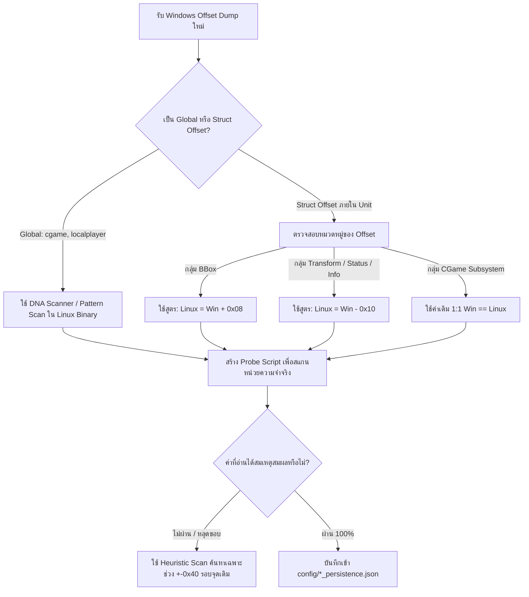

# คู่มือการแปลงและเทียบเคียง Windows Offsets เป็น Linux Offsets (War Thunder / Dagor Engine)

เอกสารนี้อธิบายหลักการ, สาเหตุความแตกต่างทางสถาปัตยกรรม (ABI/Compiler), รูปแบบการ Shift (Delta Patterns) และขั้นตอนปฏิบัติจริงในการแปลงค่า **Windows Offsets** (จาก dumper ทั่วไป เช่น monkrel, UC, DMA dumps) ไปเป็น **Linux Offsets** ที่ใช้งานได้บน Linux x86_64 ELF (`aces`)

---

## 1. ทำไม Offsets ฝั่ง Windows กับ Linux ถึงไม่ตรงกัน?

แม้ War Thunder จะใช้โค้ด C++ (Dagor Engine) ชุดเดียวกัน แต่เมื่อคอมไพล์ลง OS ต่างกัน โครงสร้างหน่วยความจำจะเปลี่ยนไปด้วย 3 สาเหตุหลัก:

### 1.1 Data Model (LLP64 vs LP64)
* **Windows (MSVC x64)**: ใช้ระบบ **LLP64**
  * `int` = 4 bytes, `long` = **4 bytes**, `long long` = 8 bytes, `pointer` = 8 bytes
* **Linux (GCC/Clang x86_64)**: ใช้ระบบ **LP64**
  * `int` = 4 bytes, `long` = **8 bytes**, `long long` = 8 bytes, `pointer` = 8 bytes
* **ผลกระทบ**: ตัวแปรใดๆ ในโค้ดของ Gaijin ที่ประกาศเป็น `long` หรือ `unsigned long` จะมีขนาด **4 bytes บน Windows แต่กลายเป็น 8 bytes บน Linux** ส่งผลให้ฟิลด์ถัดไปถูกดัน (Shift) ไปข้างหน้าอย่างน้อย 4–8 bytes ทันที

### 1.2 Structure Alignment & Padding (MSVC vs Clang)
* ตัวแปรชนิด SIMD / Vector (`Point3`, `Point4`, `Matrix44`, `__m128`):
  * ต้องจัดตำแหน่งบน Memory ให้หารด้วย 16 ลงตัว (`alignas(16)`)
  * หากฟิลด์ก่อนหน้ามีขนาดไม่พอดี MSVC กับ Clang/GCC จะแทรก Padding ไบต์ว่างต่างกัน
* Empty Base Optimization (EBO) และ Multiple Inheritance:
  * ลำดับการเรียง Vtable Pointer (`vptr`) และ Base Class Subobjects ของ Itanium C++ ABI (Linux) แตกต่างจาก Microsoft C++ ABI

### 1.3 Static Base Addresses (.rdata / .data vs .bss / .data)
* Offset ระดับ Global (เช่น `cgame_offset`, `localplayer_offset`, `active_session_offset`):
  * เป็น Relative Virtual Address (RVA) เทียบกับ ImageBase ของไฟล์ Executable
  * ไฟล์ Windows (`aces.exe`) เป็น PE format ส่วน Linux (`aces`) เป็น ELF format
  * **กฎเหล็ก**: **Global Offsets จาก Windows ไม่สามารถบวกลบเลขตรงๆ เพื่อหาพิกัดบน Linux ได้** ต้องใช้ Pattern Scanning (AOB / DNA Scanner) หรือค้นหาจาก String XREF เท่านั้น

---

## 2. กฎทองและรูปแบบ Delta ที่ค้นพบบน War Thunder (Empirical Deltas)

จากการวิเคราะห์หน่วยความจำจริงระหว่าง Windows dumps และ Linux `aces` ในโปรเจกต์นี้ พบรูปแบบการขยับของ Offset ที่สม่ำเสมอในแต่ละกลุ่มโครงสร้าง (Struct Clusters):

```
+-----------------------------------------------------------------------------------------+
|                                    CGame (Root Object)                                  |
|   ballistics (0x3F0 == 0x3F0)    camera (0x670 == 0x670)    unitlist (0x340 == 0x340)  |
+-----------------------------------------------------------------------------------------+
                                             |
                                             v
+-----------------------------------------------------------------------------------------+
|                                       Unit Object                                       |
|                                                                                         |
|  [Cluster A: BBox]                     [Cluster B: Transform]  [Cluster C: Status/Info]  |
|  Linux = Win + 0x08                    Linux = Win - 0x10      Linux = Win - 0x10       |
|  ------------------                    ------------------      ------------------       |
|  Win BBMIN: 0x250 -> Linux: 0x258      Win Pos:   0xD28        Win Invul: 0x1080/0xE80  |
|  Win BBMAX: 0x25C -> Linux: 0x264         -> Linux: 0xD18         -> Linux: 0xE70       |
|                                        Win State: 0xF80        Win Team:  0x1000        |
|                                           -> Linux: 0xF70         -> Linux: 0xFF0       |
|                                                                Win Info:  0x1010        |
|                                                                   -> Linux: 0x1000      |
+-----------------------------------------------------------------------------------------+
```

### สรุปตารางเปรียบเทียบ Offset จริง (Real-World Offset Mapping)

| หมวดหมู่ (Category) | ชื่อตัวแปร / ฟิลด์ | Windows Offset (Ref) | Linux Offset (Live) | ความต่าง (Delta) | หมายเหตุ |
| :--- | :--- | :--- | :--- | :--- | :--- |
| **CGame Pointers** | `ballistics` | `0x3F0` | `0x3F0` | **$\pm$0** | ตรงกัน 100% (Pointer layout เท่ากัน) |
| | `camera` | `0x670` | `0x670` | **$\pm$0** | ตรงกัน 100% |
| | `unitlist` | `0x340` | `0x340` | **$\pm$0** | ตรงกัน 100% |
| | `unitcount` | `0x350` | `0x350` | **$\pm$0** | ตรงกัน 100% |
| **Camera Struct** | `camera_pos` | `0x60` | `0x60` | **$\pm$0** | ตรงกัน 100% |
| | `view_matrix` | `0x1D8` / `0x258` | `0x1D8` | **$\pm$0** หรือตาม Chain | มี chain การชี้หลายสเต็ป |
| **Unit - BBox** | `bbmin` | `0x250` | `0x258` | **$+0\text{x}08$** | Linux ถูกดันไปข้างหน้า 8 bytes |
| | `bbmax` | `0x25C` | `0x264` | **$+0\text{x}08$** | ห่างจาก `bbmin` 12 bytes (`+0x0C`) เสมอ |
| **Unit - Transform** | `position` | `0xD28` | `0xD18` | **$-0\text{x}10$** | Linux ถอยกลับ 16 bytes (-0x10) |
| | `rotation_matrix`| `0xD04` | `0xCF4` / `0xD04`| **$-0\text{x}10$** หรือ $\pm$0 | อยู่ก่อนหน้า Position เสมอ |
| **Unit - Status/Info**| `unitState` | `0xF80` | `0xF70` | **$-0\text{x}10$** | Linux ถอยกลับ 16 bytes |
| | `invulnerable` | `0xE80` / `0x1080` | `0xE70` | **$-0\text{x}10$** | Linux ถอยกลับ 16 bytes |
| | `invul_timer` | `0xE5C` | `0xE4C` | **$-0\text{x}10$** | Linux ถอยกลับ 16 bytes |
| | `unitTeam` | `0x1000` | `0xFF0` | **$-0\text{x}10$** | Linux ถอยกลับ 16 bytes |
| | `unitInfo` | `0x1010` | `0x1000` | **$-0\text{x}10$** | Linux ถอยกลับ 16 bytes |
| | `player_info` | `0x1000` | `0xF78` | **Relative Shift** | ชี้ไปยัง `HumanPlayer` struct |
| | `turret_subsystem`| `0x10B8` | `0x10A8` | **$-0\text{x}10$** | Linux ถอยกลับ 16 bytes |

---

## 3. กฎความสัมพันธ์ภายใน Struct (Intra-Struct Invariants)

สิ่งที่สำคัญที่สุดคือ: **"ระยะห่างระหว่างฟิลด์ที่เกี่ยวข้องกันใน C++ จะเท่ากันเสมอทั้งบน Windows และ Linux"** แม้ว่าจุดเริ่มต้นของ Struct จะ Shift ไปก็ตาม

### กฎข้อที่ 1: Bounding Box Invariant
* `bbmax` จะอยู่ที่ตำแหน่ง:
  $$\text{Offset}(\text{bbmax}) = \text{Offset}(\text{bbmin}) + 0\text{x}0C \quad (12 \text{ bytes})$$
* เหตุผล: `bbmin` เป็น `Vector3` (`float` 3 ตัว = $3 \times 4 = 12$ bytes) ดังนั้น `bbmax` จะตามหลังมาติดกันเสมอ

### กฎข้อที่ 2: Position & Rotation Invariant
* `position` มักจะตามหลัง `rotation_matrix` หรืออยู่ติดกัน:
  $$\text{Offset}(\text{position}) = \text{Offset}(\text{rotation\_matrix}) + 0\text{x}24 \quad (36 \text{ bytes})$$
  *(ในกรณี rotation matrix ขนาด $3 \times 3$ floats = 36 bytes)*

### กฎข้อที่ 3: Spawn Shield / Invulnerability Invariant
* ใน Dagor Engine ฟิลด์จับเวลาอมตะ (`invul_timer`) จะอยู่ก่อนหน้าแฟล็กสถานะอมตะ (`invulnerable`) เสมอ:
  $$\text{Offset}(\text{invulnerable}) = \text{Offset}(\text{invul\_timer}) + 0\text{x}24$$
  *ตัวอย่างบน Linux: `0x0E4C + 0x24 = 0x0E70`*

### กฎข้อที่ 4: Fast Single-Chunk Read Window
* บน Linux ฟิลด์สถานะสำคัญจะเรียงติดกันในช่วง `0x0E40` ถึง `0x1008` (ขนาด 464 bytes):
  * `0x0E4C`: `invul_timer` (float)
  * `0x0E70`: `invulnerable` (uint8)
  * `0x0F70`: `unit_state` (uint32)
  * `0x0F78`: `player_info` (uint64 ptr)
  * `0x0FF0`: `unit_team` (uint32)
  * `0x1000`: `unit_info` (uint64 ptr)
* สามารถใช้ `read_mem(u_ptr + 0xE40, 464)` ครั้งเดียวดึงข้อมูลทั้งหมดได้ทันที

---

## 4. ขั้นตอนปฏิบัติทีละขั้นตอน (Step-by-Step Conversion Workflow)

เมื่อได้รับชุด Offsets ใหม่ของ Windows (เช่น จากอัปเดตแพตช์ใหม่ของเกม):



### ขั้นตอนที่ 1: ตรวจสอบความถูกต้องของค่าด้วย Value Sanity Rules
เวลาแปลงเสร็จ ต้องเขียนสคริปต์สั้นๆ ยืนยันบนหน่วยความจำจริงของโปรเซส `aces` เสมอ โดยตรวจสอบตามเงื่อนไข:
1. **Pointer**: ต้องมีค่าระหว่าง `0x00000000400000` ถึง `0x007FFFFFFFFFFF` (และไม่เป็น null/dangling)
2. **Float Position / Box**: ค่าพิกัดต้องเป็นตัวเลขปกติ ไม่เป็น `NaN` หรือ `Infinity`
   * BBox กว้าง/ยาว/สูง ของรถถังต้องสมเหตุสมผล ($1.0\text{ m} \le \text{dims} \le 15.0\text{ m}$)
3. **Team ID**: ต้องเป็น `1` หรือ `2`
4. **Unit State**: ต้องเป็น `0` (ปกติ), `1` (ไฟไหม้), `2` (ซากรถพัง)

### ขั้นตอนที่ 2: รันเครื่องมือ Dumper ประจำโปรเจกต์
หากมีข้อสงสัยหรือไม่แน่ใจ ให้รันเครื่องมือยืนยันในโฟลเดอร์ `tools/` เพื่อให้ระบบสแกนหาค่าจริงบน Linux:
```bash
# ตรวจสอบ Unit Status, Invulnerable, PlayerInfo
sudo .venv/bin/python3 tools/unit_status_dumper.py

# ตรวจสอบ BBox
sudo .venv/bin/python3 tools/bbox_dumper.py

# ตรวจสอบ Barrel Matrix & Bone Tree
sudo .venv/bin/python3 tools/barrel_offset_dumper.py

# ตรวจสอบ View Matrix
sudo .venv/bin/python3 tools/find_real_matrix.py
```

เมื่อเครื่องมือรันสำเร็จ ระบบจะบันทึกผลลัพธ์พร้อม `build_fingerprint` ลงในโฟลเดอร์ `config/` โดยอัตโนมัติ ทำให้โปรแกรมหลัก (`radar_overlay.py` และ `data_pump.py`) โหลดค่าที่ถูกต้องไปใช้งานได้อย่างแม่นยำครับ
